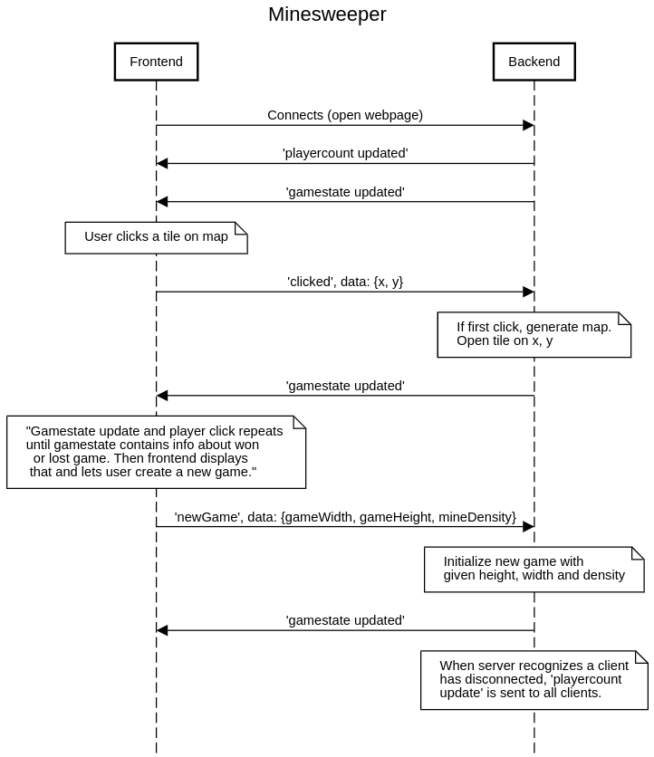

# Architecture

Game logic happens in a NodeJS Express backend. Game is rendered on a HTML/JavaScript frontend. The Express server first serves the game.html file, which contains JavaScript code, which then creates a websocket connection to server using socket.io.

The following diagram explains how the basic flow of logic happens with socket.io. Notice that there can be many frontends connected to the same backend, and all messages sent by backend are sent to **all clients** at once.

Some notices of the sequence diagram above:
+ When server receives click and runs the game logic, it may happen that the click is on a tile that is already opened before, perhaps due to a click by some other client. In this case nothing happens, no gamestate update is sent to clients, since it has been sent when the previous successful click was processed.
+ Server initializes map size when new map is generated, but mine locations are randomed only after the first click is made, to make sure that the first click cannot be a mine.

# Evaluating the architecture

We have decided that the game logic runs on backend. This way the game can be synchronized simply, as it runs on the server and the clients only render the game and inform server of clicks that user has made. Another important reason is that the secret game map, containing the mine locations, does not have to be sent to the clients. 

Alternative to this architecture could be, for example, one where the server functions only to inform the other clients of the clicks that a client has made. Client would send its click to the server, which then would send the click to all clients, including the one that made the click. A client would only run the game logic and re-render map after it has received the click from the server, even if it made the click by itself. This would keep the game in sync between clients, and it would remove the game logic work from the server. If the game was modified to have many sessions, running the logic on clients would remove the workload from the server. Another benefit would be reduced network load, since the system would only have to send simple coordinates of x and y of the click, instead of the current method, where the entire map array containing thousands of cells has to be sent on every gamestate update.

However, the alternative method would require the full map including mine locations to be sent to clients. This would make it possible for the user to view the mine locations and cheat. In a simple game like this, the possibility of cheating probably would not matter. However, it is important to note that when designing games like this in general, the system design has to take into account that any data sent to the client can possibly be viewed by the user.

